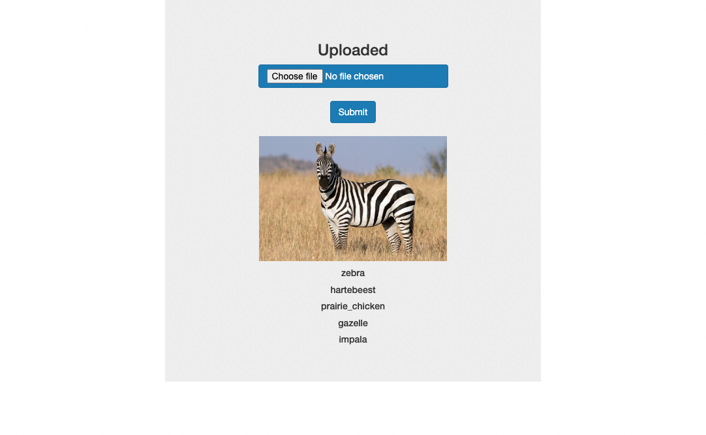

# Webdev-II exercise: A Simple deep learning REST API (Flask)
  A simple image classifier using pretrained Neural Network [ResNet50](https://keras.io/applications/#resnet50). More details about the model [here](https://blog.keras.io/building-a-simple-keras-deep-learning-rest-api.html).

## Credits
[Building a simple Keras + deep learning REST API](https://blog.keras.io/building-a-simple-keras-deep-learning-rest-api.html)

## Getting started
- Clone the repository.

Create a virtual environment
```sh
~$ conda create --name yourenvname python=3.9
```
```sh
~$ conda activate mlapp
```

Install requirements
```sh
~$ pip3 install -r requirements.txt
```
or 

```sh
~$ conda install -c conda-forge tensorflow
~$ conda install -c anaconda flask
~$ conda install -c anaconda pillow
```


* ### Run

```
~$ python3 app.py
```
Open up browser and go to:
```
http://127.0.0.1:5000.
```

* Upload a picture and click submit.




